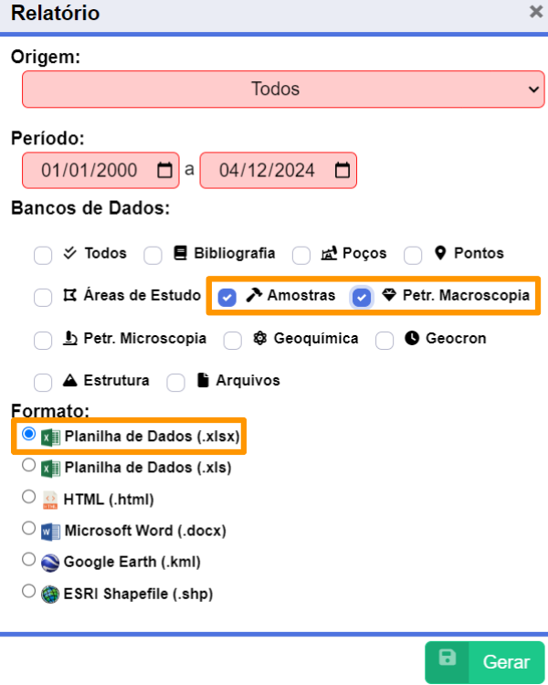

Manipulação e Integração de Dados em R
================
Theresa Rocco P Barbosa
2024-12-04

# **Parte 1 - Plataforma [LabMeg](https://www.labmeg.com) - XLSX**



## Instalação e Importação de Pacotes no R

**1. Instalar os Pacotes Necessários**

Utilize a função *install.packages()* para instalar os pacotes
necessários para o script.

``` r
# install.packages("readxl")   # Para importar arquivos Excel
# install.packages("openxlsx") # Para exportar arquivos Excel
# install.packages("dplyr")    # Para manipulação de dados
# install.packages("terra")    # Para análise espacial
# install.packages("DT")       # Para tabelas em relatórios HTML
```

**2. Carregar os Pacotes**

Após instalar os pacotes, carregue-os com a função *library()* para
garantir que suas funções estejam disponíveis.

``` r
library(readxl)
library(dplyr)
library(terra)
library(DT)
library(openxlsx)
```

## Importar Dados de um Arquivo XLSX como DataFrames

**1. Importar Arquivo XLSX com Várias Planilhas**

Arquivos Excel frequentemente contêm múltiplas planilhas (abas). Para
importar essas planilhas separadamente, utilize a função *read_excel()*
e especifique o nome da aba com o parâmetro *sheet*.

``` r
amostras <- readxl::read_excel("raw_data/exxonccs.xlsx", sheet = "Amostras (198)")
macro    <- readxl::read_excel("raw_data/exxonccs.xlsx", sheet = "Petr. Macroscopia (116)")
```

**2. Visualizar os Dados Importados**

Após importar as planilhas, é importante verificar se os dados foram
carregados corretamente. Utilize as funções *View()*, *head()*, *str()*
ou *names()* para visualizar os dados e verificar a estrutura.

- **DataFrame Amostras**

``` r
str(amostras)
```

    ## tibble [198 × 14] (S3: tbl_df/tbl/data.frame)
    ##  $ Código da Amostra                : chr [1:198] "MR-SS-47A" "MR-SS-47B" "MR-SS-46B" "MR-SS-46A" ...
    ##  $ Cadastro                         : chr [1:198] "2024-08-13 14:11:16" "2024-07-22 16:44:49" "2024-07-22 16:44:19" "2024-07-22 16:43:49" ...
    ##  $ Usuário                          : chr [1:198] "Pietra Rocha Gomes" "Pietra Rocha Gomes" "Pietra Rocha Gomes" "Pietra Rocha Gomes" ...
    ##  $ Última Alteração                 : chr [1:198] NA NA NA NA ...
    ##  $ Área                             : chr [1:198] "Área 2" "Área 2" "Área 2" "Área 2" ...
    ##  $ Ponto                            : chr [1:198] "MR-SS-47" "MR-SS-47" "MR-SS-46" "MR-SS-46" ...
    ##  $ Local de Coleta                  : logi [1:198] NA NA NA NA NA NA ...
    ##  $ Tipo(s) de Amostra               : chr [1:198] "Amostra de Mão" "Amostra de Mão" "Amostra de Mão" "Amostra de Mão" ...
    ##  $ Origem                           : chr [1:198] "Projeto" "Projeto" "Projeto" "Projeto" ...
    ##  $ Citação                          : logi [1:198] NA NA NA NA NA NA ...
    ##  $ DOI                              : logi [1:198] NA NA NA NA NA NA ...
    ##  $ Coordenadas (Lat:Long)           : logi [1:198] NA NA NA NA NA NA ...
    ##  $ Coordenadas UTM (N:E, Fuso, Hem.): logi [1:198] NA NA NA NA NA NA ...
    ##  $ Datum Geodésico                  : logi [1:198] NA NA NA NA NA NA ...

- **DataFrame Petr. Macroscopia**

``` r
str(macro)
```

    ## tibble [116 × 83] (S3: tbl_df/tbl/data.frame)
    ##  $ Cadastro                           : chr [1:116] "2024-11-18 15:24:58" "2024-11-18 07:55:02" "2024-11-04 13:12:17" "2024-11-04 12:37:42" ...
    ##  $ Usuário                            : chr [1:116] "Pietra Rocha Gomes" "Pietra Rocha Gomes" "Lara Evelyn de Lima da Pascoa" "Lara Evelyn de Lima da Pascoa" ...
    ##  $ Última Alteração                   : chr [1:116] NA "18/11/24 14:46 - pietraferreirarocha@gmail.com" "04/11/24 13:33 - Larapascoa@ufrrj.br" "04/11/24 12:42 - Larapascoa@ufrrj.br" ...
    ##  $ Origem                             : chr [1:116] "Projeto" "Projeto" "Projeto" "Projeto" ...
    ##  $ Citação                            : logi [1:116] NA NA NA NA NA NA ...
    ##  $ DOI                                : logi [1:116] NA NA NA NA NA NA ...
    ##  $ Código da Amostra                  : chr [1:116] "CD-BV-19A" "CD-BV-19D" "CD-BV-13A" "CD-BV-11" ...
    ##  $ Amostra selecionada para laminação?: chr [1:116] "NÃO DEFINIDO" "NÃO DEFINIDO" "SIM" "SIM" ...
    ##  $ Grau de Alteração                  : chr [1:116] "PARCIALMENTE ALTERADO" "PARCIALMENTE ALTERADO" "ALTERADO" "PARCIALMENTE ALTERADO" ...
    ##  $ Natureza                           : chr [1:116] "NÃO COERENTE" "NÃO COERENTE" "NÃO COERENTE" "NÃO COERENTE" ...
    ##  $ % Matriz...11                      : num [1:116] 0 NA NA NA NA NA 0 NA NA NA ...
    ##  $ % Megacristais                     : num [1:116] 100 NA NA NA NA NA 100 NA NA NA ...
    ##  $ Composição Essencial...13          : chr [1:116] NA NA NA NA ...
    ##  $ Composição Acessória               : chr [1:116] NA NA NA NA ...
    ##  $ Megacristais                       : chr [1:116] NA NA NA NA ...
    ##  $ Produto de Alteração               : chr [1:116] NA NA NA NA ...
    ##  $ Observações...17                   : chr [1:116] NA NA NA NA ...
    ##  $ Dimensão dos Cristais              : chr [1:116] "NÃO DEFINIDO" NA NA NA ...
    ##  $ Observações...19                   : chr [1:116] NA NA NA NA ...
    ##  $ Grau de Cristalinidade             : chr [1:116] NA NA NA NA ...
    ##  $ Observações...21                   : chr [1:116] NA NA NA NA ...
    ##  $ Forma Geral dos Grãos              : chr [1:116] NA NA NA NA ...
    ##  $ Observações...23                   : chr [1:116] NA NA NA NA ...
    ##  $ Granulometria...24                 : chr [1:116] NA NA NA NA ...
    ##  $ Observações...25                   : chr [1:116] NA NA NA NA ...
    ##  $ Relação Intergranular              : chr [1:116] NA NA NA NA ...
    ##  $ Observações...27                   : chr [1:116] NA NA NA NA ...
    ##  $ Foliações                          : chr [1:116] NA NA NA NA ...
    ##  $ Observações...29                   : chr [1:116] NA NA NA NA ...
    ##  $ Lineações                          : chr [1:116] NA NA NA NA ...
    ##  $ Observações...31                   : chr [1:116] NA NA NA NA ...
    ##  $ Fraturas                           : chr [1:116] NA NA NA NA ...
    ##  $ Observações...33                   : chr [1:116] NA NA NA NA ...
    ##  $ Veios                              : chr [1:116] NA NA NA NA ...
    ##  $ Observações...35                   : chr [1:116] NA NA NA NA ...
    ##  $ Outras Estruturas...36             : chr [1:116] NA NA NA NA ...
    ##  $ Observações...37                   : chr [1:116] NA NA NA NA ...
    ##  $ % Matriz...38                      : num [1:116] 75 85 30 92 90 75 85 15 25 85 ...
    ##  $ % Clastos                          : num [1:116] 25 16 70 8 10 25 15 85 75 15 ...
    ##  $ Observações...40                   : logi [1:116] NA NA NA NA NA NA ...
    ##  $ Classificação Textural             : chr [1:116] "MATRIZ SUPORTADA" "MATRIZ SUPORTADA" "CLASTO SUPORTADO" "MATRIZ SUPORTADA" ...
    ##  $ Observações...42                   : logi [1:116] NA NA NA NA NA NA ...
    ##  $ Borda                              : chr [1:116] "NÃO REATIVA" "NÃO REATIVA" "NÃO REATIVA" "REATIVA" ...
    ##  $ Observações...44                   : logi [1:116] NA NA NA NA NA NA ...
    ##  $ Tipo de Contato                    : chr [1:116] "NÃO RETILÍNEO" "RETILÍNEO" "SERRILHADO" "RETILÍNEO" ...
    ##  $ Observações...46                   : logi [1:116] NA NA NA NA NA NA ...
    ##  $ Seleção                            : chr [1:116] "POLIMÍTICO" "POLIMÍTICO" "OLIGOMÍTICO" "OLIGOMÍTICO" ...
    ##  $ Observações...48                   : logi [1:116] NA NA NA NA NA NA ...
    ##  $ Cor...49                           : num [1:116] 3 5 1 1 3 3 3 1 1 2 ...
    ##  $ Observações...50                   : logi [1:116] NA NA NA NA NA NA ...
    ##  $ Granulometria...51                 : chr [1:116] "< 2 MM" "> 64MM" "> 64MM" "64-2 MM" ...
    ##  $ Observações...52                   : logi [1:116] NA NA NA NA NA NA ...
    ##  $ Geometria                          : logi [1:116] NA NA NA NA NA NA ...
    ##  $ Observações...54                   : logi [1:116] NA NA NA NA NA NA ...
    ##  $ Arredondamento                     : chr [1:116] "SUBANGULOSO" "SUBANGULOSO" "SUBANGULOSO" "SUBANGULOSO" ...
    ##  $ Observações...56                   : logi [1:116] NA NA NA NA NA NA ...
    ##  $ Estruturas                         : logi [1:116] NA NA NA NA NA NA ...
    ##  $ Observações...58                   : logi [1:116] NA NA NA NA NA NA ...
    ##  $ Granulometria...59                 : chr [1:116] "ARGILA (< 0,003 MM)" "ARGILA (< 0,003 MM)" "SILTE (0,06 - 0,003 MM)" "AREIA (2 - 0,06 MM)" ...
    ##  $ Observações...60                   : logi [1:116] NA NA NA NA NA NA ...
    ##  $ Recristalização                    : chr [1:116] "PRESENTE" "AUSENTE" "AUSENTE" "AUSENTE" ...
    ##  $ Observações...62                   : logi [1:116] NA NA NA NA NA NA ...
    ##  $ Composição Essencial...63          : chr [1:116] "CALCITA: 100%" NA "ARGILOMINERAIS: 100%" "ARGILOMINERAIS: 30%, QUARTZO: 70%" ...
    ##  $ Cor...64                           : num [1:116] 3 5 3 3 3 3 3 3 3 2 ...
    ##  $ Observações...65                   : logi [1:116] NA NA NA NA NA NA ...
    ##  $ Cimentação                         : chr [1:116] "AUSENTE" "AUSENTE" "AUSENTE" "AUSENTE" ...
    ##  $ Observações...67                   : logi [1:116] NA NA NA NA NA NA ...
    ##  $ Foliação Primária                  : chr [1:116] "AUSENTE" "AUSENTE" "AUSENTE" "AUSENTE" ...
    ##  $ Observações...69                   : logi [1:116] NA NA NA NA NA NA ...
    ##  $ Fratura                            : chr [1:116] "AUSENTE" "AUSENTE" "AUSENTE" "AUSENTE" ...
    ##  $ Observações...71                   : logi [1:116] NA NA NA NA NA NA ...
    ##  $ Outras Estruturas...72             : logi [1:116] NA NA NA NA NA NA ...
    ##  $ Observações...73                   : logi [1:116] NA NA NA NA NA NA ...
    ##  $ Classificação                      : chr [1:116] "PEPERITO" "PEPERITO" "PEPERITO" "PEPERITO" ...
    ##  $ Observações...75                   : chr [1:116] "A rocha é não coerente, anisotrópica, hipocristalina, em torno de 75% matriz e 25% de clastos sendo matriz supo"| __truncated__ "A rocha é não coerente, anisotrópica, hipocristalina, tem em torno de 86% vol matriz e 15%vol de clastos, e col"| __truncated__ "A rocha é não-coerente, hipocristalina, clasto suportada com 30% vol. matriz e 70% vol. clastos. Exibe contato "| __truncated__ "A rocha é não-coerente, hipocristalina, matriz suportado com 92% vol. matriz e 8% vol. clastos. Exibe contato m"| __truncated__ ...
    ##  $ Imagens e Arquivos                 : num [1:116] 0 0 5 4 4 5 0 4 3 4 ...
    ##  $ ...77                              : chr [1:116] NA NA "http://labmeg.com/projetos/15/2563-13-CD-BV-13A visao geral .jpg" "http://labmeg.com/projetos/15/2562-f1-CD-BV-11 visao geral peperito.jpg" ...
    ##  $ ...78                              : chr [1:116] NA NA "http://labmeg.com/projetos/15/2563-8f-CD-BV-13A detalhe do preenchimento.jpg" "http://labmeg.com/projetos/15/2562-91-CD-BV-11 detalhe basalto.jpg" ...
    ##  $ ...79                              : chr [1:116] NA NA "http://labmeg.com/projetos/15/2563-3f-CD-BV-13A detalhe fratura.jpg" "http://labmeg.com/projetos/15/2562-84-CD-BV-11 basalto com amigdalas.jpg" ...
    ##  $ ...80                              : chr [1:116] NA NA "http://labmeg.com/projetos/15/2563-99-CD-BV-13A detalhe preenchimento geodo (1).jpg" "http://labmeg.com/projetos/15/2562-6a-CD-BV-11 detalhe amigdalas.jpg" ...
    ##  $ ...81                              : chr [1:116] NA NA "http://labmeg.com/projetos/15/2563-01-CD-BV-13A detalhe preenchimento geodo.jpg" NA ...
    ##  $ ...82                              : chr [1:116] NA NA NA NA ...
    ##  $ ...83                              : chr [1:116] NA NA NA NA ...

## Seleção de Colunas Específicas de um DataFrame

Quando se trabalha com grandes conjuntos de dados, pode ser necessário
selecionar apenas as colunas relevantes para análise. A função select()
do pacote dplyr é útil para essa tarefa.

**1. Selecionar Colunas de Interesse**

A função dplyr::select() permite selecionar colunas de um dataframe
informando os nomes das colunas desejadas.

Use o operador pipe (\|\>) para aplicar a função *select()* aos
DataFrames e escolher as colunas de interesse.

- **DataFrame Amostras “clean”**

``` r
amostras <- amostras |> dplyr::select(`Código da Amostra`, 
                                      Ponto, 
                                      Área)
head(amostras)
```

- **DataFrame Petr. Macroscopia “clean**

``` r
macro <- macro |> dplyr::select(`Código da Amostra`,
                                Classificação,
                                `Grau de Alteração`, 
                                Natureza, 
                                `Outras Estruturas...36`,
                                # `Dimensão dos Cristais`, 
                                # `Grau de Cristalinidade`, 
                                # `Forma Geral dos Grãos`, 
                                # Granulometria...24,
                                # Fraturas,
                                # Foliações,
                                # Veios, 
                                # Seleção,
                                # Granulometria...51,
                                # Granulometria...59,
                                # Arredondamento
                                )
head(macro)
```

## Renomeando Colunas em um DataFrame

Evitar acentos, espaços e caracteres especiais em nomes de colunas é uma
boa prática de programação, pois aumenta a compatibilidade e
legibilidade do código.

**1. Verificar os Nomes Atuais das Colunas**

Antes de renomear, verifique os nomes atuais das colunas nos DataFrames.

``` r
names(amostras)
```

    ## [1] "Código da Amostra" "Ponto"             "Área"

``` r
names(macro)
```

    ## [1] "Código da Amostra"      "Classificação"          "Grau de Alteração"      "Natureza"              
    ## [5] "Outras Estruturas...36"

**2. Renomeando**

Use a função *rename()* do pacote dplyr para renomear as colunas. O
formato básico é:

*dataframe \<- dataframe \|\> dplyr::rename(* **novo_nome** *=*
**nome_atual** *)*

- Renomeando as Colunas de amostras

``` r
amostras <- amostras |> 
  dplyr::rename(
    id_amostra  = `Código da Amostra`,
    id_pt       = Ponto,
    area        = Área
    )
```

- Renomeando as Colunas de macro

``` r
macro <- macro |> 
  dplyr::rename(
    id_amostra  = `Código da Amostra`,
    lito        =  Classificação,
    grau_alt    =  `Grau de Alteração`,
    natureza    =  Natureza,
    estr_outr   = `Outras Estruturas...36`
    )
```

**3. Verificando os Novos Nomes**

Após renomear, confirme que os novos nomes foram aplicados corretamente.

``` r
names(amostras) # Nomes das colunas atualizados para o DataFrame "amostras"
```

    ## [1] "id_amostra" "id_pt"      "area"

``` r
names(macro)    # Nomes das colunas atualizados para o DataFrame "macro"
```

    ## [1] "id_amostra" "lito"       "grau_alt"   "natureza"   "estr_outr"

*Dica:* Use a função *janitor::clean_names()* do pacote *janitor* para
renomear várias colunas de forma sistemática.

## Integrando os DataFrames

Quando dois DataFrames compartilham uma coluna em comum, podemos uni-los
para integrar informações.

**1. Verificação de Duplicadas em amostras e macro**

Verificar se existem duplicatas nas colunas de junção antes de realizar
a junção.

``` r
duplicatas_amostras <- amostras |> dplyr::count(id_amostra) |> dplyr::filter(n > 1)
duplicatas_macro    <- macro    |> dplyr::count(id_amostra) |> dplyr::filter(n > 1)
```

- Duplicados em amostras

``` r
duplicatas_amostras
```

- Duplicados em macro

``` r
duplicatas_macro
```

Se encotrar amostras duplicadas: *RETORNE AO LABORATÓRIO!*

**2. Verificar se todas as amostras de macro estão em amostras**

Antes de realizar a junção, é importante verificar se todas as amostras
de macro estão presentes em amostras. Para isso, utilizamos a função
*anti_join()* do dplyr para identificar amostras em macro que não têm
correspondência em amostras.

``` r
faltantes <- macro |> dplyr::anti_join(amostras, by = "id_amostra")
nrow(faltantes)
```

    ## [1] 0

O que faz anti_join()?

- Retorna as linhas do DataFrame à esquerda (macro) que não possuem
  correspondência no DataFrame à direita (amostras).
- No nosso caso, faltantes conterá as linhas de macro que não estão em
  amostras.
- Se nrow(faltantes) for igual a 0, significa que significa que **todas
  as id_amostra de macro estão presentes em amostras**.

**3. Juntando os DataFrames**

Utilize **left_join()** para integrar os dois DataFrames, mantendo todas
as linhas de amostras e adicionando as informações de macro onde houver
correspondência.

``` r
amostras_macro <- amostras |> 
  dplyr::left_join(macro, by = "id_amostra")
```

**4. Verificar o Resultado da Junção**

Após a junção, o DataFrame amostras_macro conterá todas as colunas de
amostras e as colunas adicionais de macro onde houver correspondência
pela coluna id_amostra.

``` r
names(amostras_macro)
```

    ## [1] "id_amostra" "id_pt"      "area"       "lito"       "grau_alt"   "natureza"   "estr_outr"

## Exportando o novo DataFrame em XLSX

A função *write.xlsx()* salva o DataFrame amostras_macro em um arquivo
Excel no diretório especificado pelo caminho *output_path*.

``` r
output_path <- "clean_data/amostras_macro.xlsx"
write.xlsx(amostras_macro, output_path)
```
